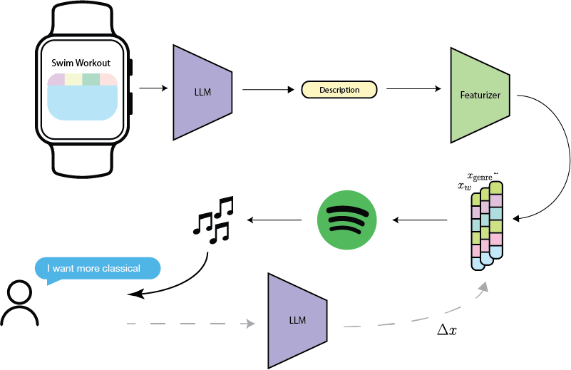

# 6.8611 Final Project

Alan Yu Evan Liu Michael Peng

## Overview of Model and Usage
The pipeline can be summarized in the below picture.




<!-- TABLE OF CONTENTS -->
<details>
  <summary>Table of Contents</summary>
  <ol>
    <li>
      <a href="#about-the-project">About The Project</a>
    </li>
    <li>
      <a href="#getting-started">Getting Started</a>
      <ul>
        <li><a href="#prerequisites">Prerequisites</a></li>
        <li><a href="#installation">Installation</a></li>
      </ul>
    </li>
  </ol>
</details>


<!-- ABOUT THE PROJECT -->
## About The Project

We built a music recommendation system using LLMs that take in biometric apple watch data with the ability to fine-tune their recommendations using human-feedback.


<!-- GETTING STARTED -->
## Getting Started


### Prerequisites

Install all the required libraries by installing the requirements.

  ```sh
  conda create -n lang python=3.11
  conda activate lang
  pip install -r requirements.txt
  ```

### Installation 

Follow the instructions to set up the repository in your local computer and IDE.

1. Get your Spotify Credentials by following the tutorial here: https://www.youtube.com/watch?v=WHugvJ0YR5I

2. Update `.env` with your credentials for both SPOTIPY_CLIENT_ID and SPOTIPY_CLIENT_SECRET, as well as OPENAI_API_KEY. Instructions on obtaining an OpenAI API Key can be found on the OpenAI website.


## Prompts

In few_shot, we used the following prompts to generate the feature vector and list of appropriate genres respectively. These prompts can be further fine-tuned or adjusted to fit your purposes.

    "Analyze the playlist description: '{}', and create a feature vector that reflects its musical style. Focus on these specific features: {}. Crucially, base your analysis on the data provided in the dataframe, which includes example features and their corresponding genres.Examine the association between the genres and their feature vectors in the dataframe to inform your vector creation. Generate a feature vector that resonates with the playlist description, ensuring that each value you assign is grounded in the data observed in the dataframe. The response should be a Python dictionary, formatted as: 
    {{'feature1': value1, 'feature2': value2, 'feature3': value3, ...}}. Your vector must align with the playlist's thematic elements and the genre data in the dataframe—avoid hallucinating values. Submit only the feature vector dictionary, without extra explanations. In your analysis, pay careful attention to how the musical attributes of the genres, as represented in the dataframe, correlate with your feature selections. Proceed systematically, ensuring each feature choice is data-driven and reflective of the playlist's style. Use the genres and features in the dataframe as a reference point. While the exact genres of your playlist might not be listed, derive your vector values from similar genres and their features in the dataframe, avoiding assumptions not supported by the data."


    "From the provided list of genres: {}, select genres that best align with the given music description, specified as {}. Your task is to analyze the characteristics of each genre and identify those that correspond closely to the music style described. Present your chosen genres in the format of a Python list. For instance, if the matching genres are 'ambient', 'classical', and 'jazz', your response should look like: ['ambient', 'classical', 'jazz']. Focus on the defining features of each genre and how they relate to the music description. Ensure your selection is based on how well each genre reflects the characteristics of the described music style."


## Example Playlist Generation

Swimming activity few-shot LLM playlist generation: https://open.spotify.com/playlist/1PIrwPQgxMrK5wt9bbw6IS?si=ebf5167ba0f14bee&nd=1&dlsi=aae624f79e594fdf

Human-Feedback prompt: "I actually prefer rap or hip-hop songs when I swim. Can you make that change for me?” 

Swimming activity post-feedback: https://open.spotify.com/playlist/0GfE7Zb1kZdVSAfQ9BWlEg?si=39ce584df7954176&nd=1&dlsi=e40490f497314ac6

Study activity: https://open.spotify.com/playlist/10ybamjeVsYrQxAJAtBn4U?si=9d74223b4ae54328

Midnigth Stroll: https://open.spotify.com/playlist/5SKMJ3f7ZZ5vySouZmeUla?si=6b07d0be3eca4341


<!-- watch -> LM (few shot or feature generator) -> "watch target" t_w

Watch input:
    Swimming
        - heartrate
        - stroke count
        - distance
        - calories burned
        - external temperature
    Running
        - heartrate
        - stride length
        - distance
        - calories burned
        - external temperature
        


two options to generate initial recommendations:

1. t_w + predict genre -> SP -> recs
2. t_w + my top k songs -> SP -> recs
3. (alan featurizer) t_w + examples -> feat + genre -> SP

(alan featurizer): improve sampling, can also generate multiple target features, and derive a range from that. 


how to adjust to user feedback? input x

x -> LM -> which audio components to adjust
small shift in each coordinate (hyperparameter)
- database, for each user save 
                each context vector for each different context

        


can also ask user to rank on a scale from 1 to 10 -->
